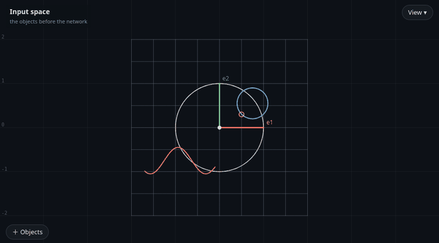
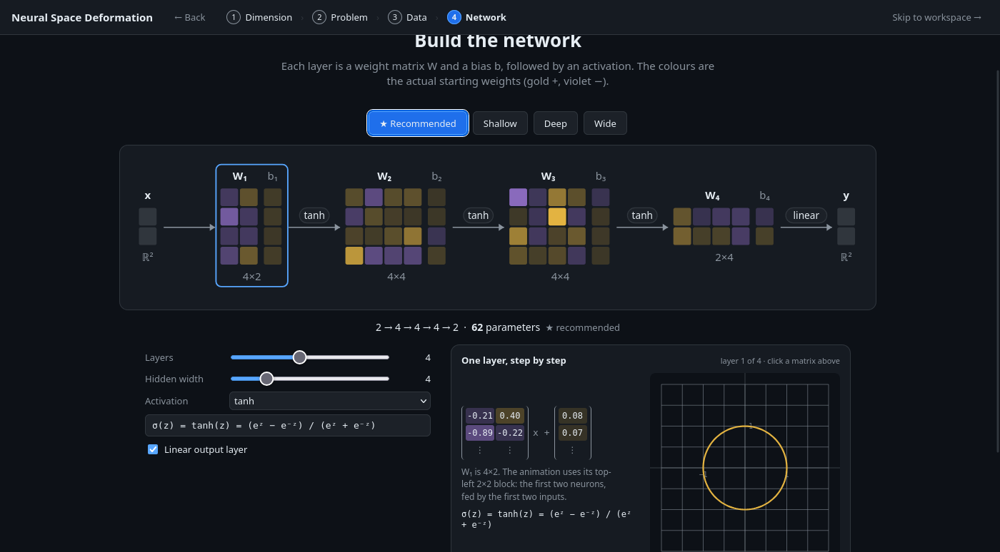
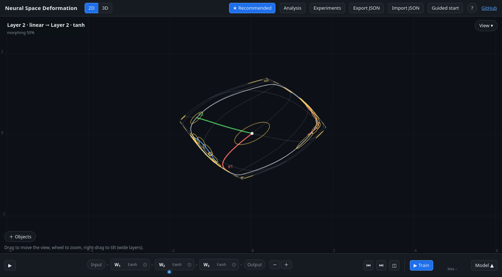
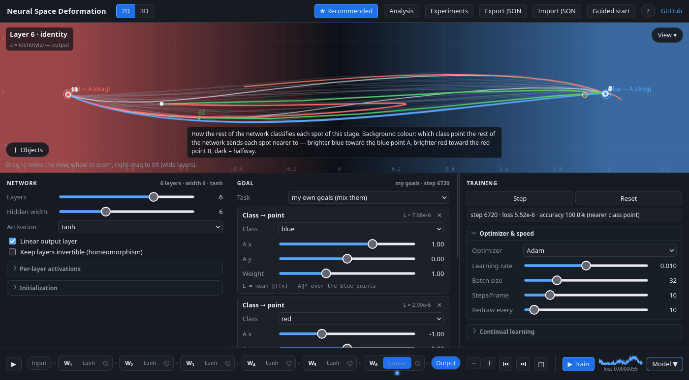
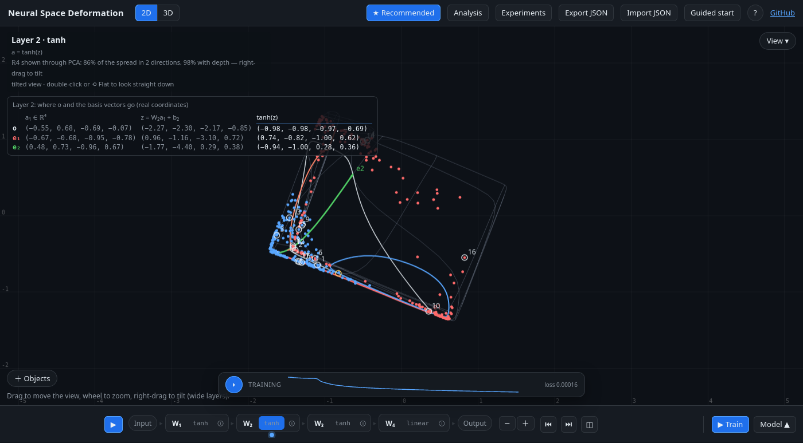
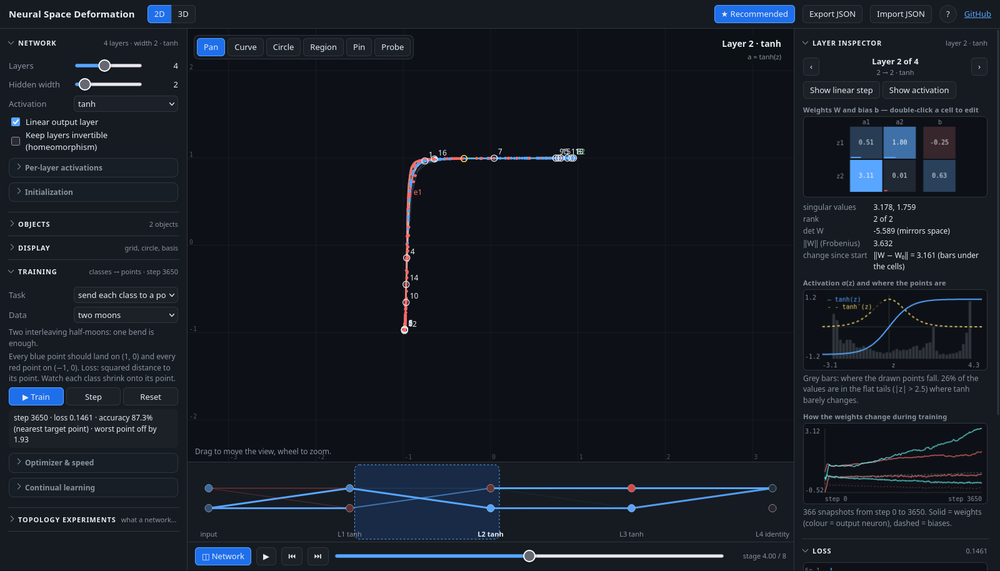
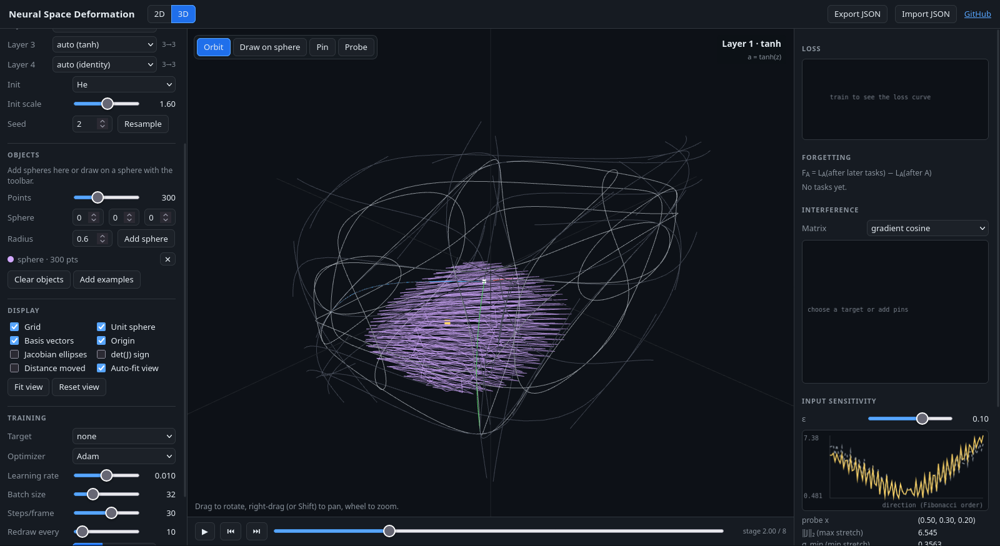

# Neural Space Deformation

**Neural Space Deformation is an interactive, browser-only visualization of what a small neural network
(MLP) does geometrically:** every layer bends, stretches, folds and squashes space, and backpropagation
reshapes those deformations while it trains. It was built by
[Eren Can Almaz](https://writerforight.github.io), an Electrical Engineering student at RWTH Aachen
University.

**▶ Live demo: https://writerforight.github.io/mlp-space-deformation/**



There is no backend, no build step and no machine-learning library. The MLP, backpropagation, SGD,
Adam, Jacobians, PCA, the neural tangent kernel and the continual-learning methods are written from
first principles in plain JavaScript (`src/nn.js`, with comments). Three.js (loaded from a CDN) is used
only to draw the 3D view.

## Guided start

The page opens with a short guided start: pick **2D or 3D**, then a **problem** (classification, copy a
linear map, shape to shape, or just look), then the **data** (each card opens with its settings: number
of points, noise, map strength), then the **network**, drawn as its actual weight matrices with the
starting weights. Every card plays a small preview computed by a tiny network trained in the page.
The problems include **Send classes anywhere** (blue to a point A, red to a point B, both draggable later).
*Open the workspace* applies all choices (and, if ticked, starts a short **tour** of the workspace — also under **?** → *Take the tour*); **I know how to use it** (or a link ending in `#workspace`)
goes straight to the full workspace, and **Guided start** in the header opens the guide again.
Code: `src/wizard.js` (flow) and `src/minis.js` (previews).



## The workspace

One big view; everything else opens on demand, and one panel at a time (✕, Esc or a click outside closes it).

- **The strip at the bottom is the network**: `Input ▸ [W₁ | tanh] ▸ … ▸ Output`. Click a step to go there,
  drag along the strip to scrub, ⓘ inspects a layer, − / ＋ change the depth. ▶ Train sits on the right;
  **Model ▲** opens network | goal | training settings.
- **Training timeline**: once a network has trained, a video-style bar on the view shows the loss of the
  whole run. Drag on it to see the network at any earlier step, ⏵ replays the training, ● live returns;
  training from an old step continues from there.
- **Tools**: click the active tool again, the tool badge on the view, or Esc to go back to panning; the
  Objects panel stays open while you draw.
- **＋ Objects** (bottom left): ready-made shapes, drawing by hand, and a card per object (colour, size,
  position, number of points). **ⓘ How it changes** logs what every layer does to the object: length,
  stretch, signed area (mirrored when negative) and self-crossings.
- **Basis vectors box** (top left, under the stage name): where the origin and e₁, e₂ (e₃) are before the
  current layer, after its linear step and after its activation — in the layer's real coordinates, also
  when the view shows a wide layer through PCA. **Model ▲ → Show the weight matrices** lists every `W` and
  `b` as numbers (gold +, violet −), live while training.
- **View ▾** (top right): overlays, the class background (at every stage: how the rest of the network
  classifies each spot), and for 2D a third principal direction of wide layers as depth — right-drag to
  tilt the view and see how a wide layer lifts points over each other.
- **My own goals**: a goal sends some points somewhere — a class to a point you drag, the classes apart
  (cross-entropy), an object to a point, an object kept in place, or pinned points (Pin tool). Goals train together with weights;
  each card shows its loss formula and current value. The engine supports a loss type and weight per
  sample for this (`src/nn.js`, checked against finite differences).

## Things to try

1. **Watch a network bend space.** Press ▶ at the left of the strip (or Space): the grid, the unit circle
   and the example objects go through each layer — first the linear map, then the activation. Click a
   step in the strip to jump there, or drag along it.
2. **Look inside a layer.** Click ⓘ next to a layer in the strip. The *Layer inspector* shows its weight
   matrix `W` and bias `b` as a heatmap (gold +, violet −; blue and red always mean the two classes), its
   activation function with the derivative and a histogram of where the points actually land, and how
   every weight moved during training. Double-click a weight, type a new value and watch the
   deformation change.
3. **Send each class wherever you want.** Model ▲ → Task *my own goals*, Data *spirals*, press
   **★ Recommended**, then **▶ Train**. Blue points are pulled to A, red points to B; jump to Output and
   drag A or B while it trains. Add *Object stays* to keep a shape in place at the same time.
4. **Look into a wide layer.** With width 4 or more in 2D, go to a hidden step and right-drag the view:
   the third principal direction becomes depth, and you can see how the layer lifts one class over the
   other. The class background (View ▾) says how often its 2D slice agrees with the network.
5. **Topology experiments: what a network can and cannot do.** *Experiments* (top right) shows for every
   experiment whether it works at width *d* and with one extra dimension. Click one (e.g. 3D → *Ball out
   of the shell*), run **Width 3 — expected: fails**, then **Width 4 — expected: works**; the result line
   says whether your run solved it. Watch "worst point off by" — it is measured on a 50× finer copy of
   the shape, because the network otherwise cheats by stretching the piece of a curve between two
   training points around the obstacle.
6. **Catastrophic forgetting.** Task *pinned points*, drag a few pins with the Pin tool (＋ Objects),
   Model ▲ → Continual learning → Mode *sequential*, train with anti-forgetting *none*, then with
   *replay*, *OGD* or *EWC*, and compare the Forgetting table under *Analysis*.







## What it shows

- **Forward view.** Draw curves, circles, filled regions (2D) or spheres and curves on spheres (3D).
  Each object is sampled into 200–500 points connected in order, together with the reference grid,
  the unit circle/sphere, the basis vectors and the origin. Click or drag along the strip to see the
  objects after each layer — every layer is split into its **linear** step (`z = W a + b`) and its
  **activation** step (`a = σ(z)`), with a smooth morph in between.
- **Network diagram and layer inspector.** The inspector first follows one point through the layer:
  the origin or a basis vector (e₁ = (1, 0) enters layer 1 as itself, later layers receive it where it has
  arrived), shown as in → `W` and `b` → `z = W·a + b` → σ → out; hovering an entry of `z` shows its whole
  sum. ◫ in the strip opens a diagram of the network: one column per
  layer, edges coloured and weighted by `W` (gold positive, violet negative), neurons filled by their value
  at the probe point. Click a layer to inspect it: `W`/`b` heatmap with the change since initialization
  under each cell, singular values, rank, `det W`, norms; the activation `σ(z)` and `σ′(z)` with a
  histogram of the pre-activations `z` (and a note such as "26 % of the values are in the flat tails of
  tanh"); and the history of every weight of the layer over training. Any weight or bias can be edited
  by double-clicking it.
- **Overlays.** Local Jacobian ellipses (how a tiny circle is deformed), the sign of `det J`
  (green = orientation kept, violet = mirrored, i.e. a fold) and the distance each point moved.
- **Network.** 1–8 layers, hidden width 1–16 (wider layers are shown through a PCA projection),
  per-layer activation (identity, ReLU, tanh, sigmoid, GELU, sin), initialization (normal, uniform,
  Xavier, He) with scale and seed, and a **temperature** slider that randomizes the activations.
- **Training view.** Pick a task and watch backpropagation reshape space:
  - **send each class to a point** — every blue point should land on `(1, 0[, 0])`, every red point on
    `(−1, 0[, 0])` (MSE). The clearest picture of classification: each class cloud is squashed onto its
    point and the region between the classes is stretched into a cliff — a tiny version of the
    "neural collapse" seen in large classifiers;
  - **my own goals**: any mix of class → point (drag the point), separate the classes, object → point and
    object stays, each with a weight;
  - **separate classes** with two output logits and cross-entropy;
  - **match a linear map** (rotation, shear, scaling) with MSE;
  - **pinned points**: drag from an input point to where its output should go.

  Datasets, from easy to hard: two blobs (already linearly separable), two moons, a disk inside a ring,
  XOR, a wavy boundary, three nested rings, spirals, a checkerboard, **linked rings** (3D) — and
  **paint your own** with a blue/red brush. SGD or Adam, batch size, learning rate, steps per frame,
  redraw interval, loss curve and accuracy.
- **Topology.** Ready-made shapes — circle, square, star, figure eight, two circles, disk inside a ring;
  sphere, ellipsoid, cube, torus, unknotted ring, trefoil knot, linked rings, ball inside a shell — as
  objects or as training data. A task *turn one shape into another* (point i of one shape → point i of
  the other), a **homeomorphism mode** that keeps every layer invertible, and one-click experiments
  that show where invertible networks hit a wall and how one extra dimension gets past it.
- **Continual learning.** Sequential mode trains on one target (pin, or a chunk of the dataset) at a
  time. Anti-forgetting: replay buffer, orthogonal gradient projection (OGD) or an EWC penalty.
- **Analysis.** Forgetting `F_A`, gradient interference (cosine matrix) or the neural tangent kernel,
  input sensitivity (finite differences vs. the Jacobian, Lipschitz estimates), and an invertibility
  report per layer (rank, singular values, collapse warnings).
- **You stay in control.** Nothing changes your settings or the view on its own: zoom with the wheel,
  pan by dragging. One button, **★ Recommended**, aligns everything to settings that work well for the
  current task and data (layers, width, activations, initialization, optimizer) and fits the view.
- **Interface.** A guided start for first visits; then one big view with everything else on demand
  (see *The workspace* above). The page only draws when something changes, so an idle tab costs almost
  nothing. Keyboard: <kbd>Space</kbd> play/pause, <kbd>←</kbd>/<kbd>→</kbd> step through the layers,
  <kbd>T</kbd> train, <kbd>Esc</kbd> closes a panel; the **?** button shows a quick guide.
- **Share.** Export/import the full state (architecture, seed, weights, objects, pins, settings) as JSON.

## Run locally

Open `index.html` in a browser. That's it — the scripts are classic `<script>` files, so it also works
from `file://`. (Three.js is loaded from cdnjs; the 2D view works offline.)

To run the math tests (backprop vs. finite differences, Jacobians, eigen-solver, training,
anti-forgetting methods):

```bash
node test/nn.test.js
```

End-to-end checks in a real browser (guided start, panels, the model strip, objects, goals, the training
timeline, the class background and tilt, 2D ↔ 3D, the basis box and inspector, a narrow screen). They
need Firefox and geckodriver, and only Python's standard library:

```bash
python3 test/browser_test.py            # all checks
python3 test/browser_test.py goals      # only the checks whose name contains "goals"
```

## Deploy on GitHub Pages

1. Push this folder to a GitHub repository.
2. **Settings → Pages → Build and deployment → Source: Deploy from a branch → Branch: `main` / `(root)`**.
3. After a minute the app is live at `https://<user>.github.io/<repository>/`.

## Project structure

```
index.html      layout, styles, controls
src/nn.js       tensor/MLP module: forward, backprop, Jacobians, losses, SGD, Adam, PCA,
                datasets, Trainer (joint / sequential, replay, OGD, EWC), analysis helpers
src/viz2d.js    Canvas renderer (pan/zoom) and small charts (loss, heatmap)
src/viz3d.js    Three.js renderer with a minimal orbit camera and ray picking
src/inspector.js network diagram and layer inspector (weight heatmap, activation, weight history)
src/ui.js       state, controls, traces through the layers, interaction, training loop, objects, goals
src/shell.js    workspace layout: popovers, the right-hand sheet, the model drawer (one panel at a time)
src/strip.js    the model strip: the network as the path a point travels, scrubbing, loss sparkline
src/wizard.js   the guided start (dimension → problem → data → network)
src/minis.js    the guided start's previews (tiny networks trained in the page) and the one-layer demo
test/           nn.test.js: the math in nn.js (node) · browser_test.py: the page, end to end (Firefox)
```

## Math background

### A network is a composition of maps

An MLP with layers `l = 1…L` computes

```
z_l = W_l a_{l-1} + b_l          (affine map: rotate, stretch, shear, project, translate)
a_l = σ_l(z_l)                    (activation, applied coordinate-wise)
```

so the network is `f = σ_L ∘ A_L ∘ … ∘ σ_1 ∘ A_1`. Pushing a whole curve or region through each
map one at a time shows what the network does to *space* rather than to one point. Affine maps keep
straight lines straight and parallel lines parallel; the activations are what bend space. ReLU folds
everything with a negative coordinate onto an axis (when the width equals the dimension this
destroys information), tanh and sigmoid squash space into a box, and sin wraps it around, folding it
onto itself. Classification networks are trained until the two classes become **linearly
separable** in the output space: the decision boundary there is the line `logit₁ = logit₂`.
When the task is to send each class to its own point, the network must do something even more
drastic: squash each class onto a single point (the Jacobian there tends to zero, `det J ≈ 0`) while
tearing the classes apart in between (large `‖J‖` near the decision boundary). With width 2 the whole
plane typically ends up folded onto the segment between the two target points.

### Topology: what a network can and cannot do

A layer whose weight matrix is invertible, followed by an injective activation (tanh, sigmoid,
identity), is a continuous map with a continuous inverse. A stack of them with width equal to the
dimension *d* is therefore a **homeomorphism**: it can bend and stretch space, but never tear or glue it.
Everything topological is preserved: the number of pieces, holes, which shape lies inside which, how
curves are linked or knotted — and even orientation. Invertible matrices come in two pieces (det > 0 and
det < 0), and training that keeps them invertible can never cross from one to the other.

The app's **homeomorphism mode** enforces this: after every step it raises the smallest singular value
of each square weight matrix to at least 0.2. The **Topology experiments** panel then runs each task at
width *d* and with one extra dimension (*d* + 1). The extra dimension lets shapes pass around each
other (a ring can slip past another ring in 4D, and every knot comes undone there). The final layer
back to *d* dimensions is a projection, so it can also glue points together.

Measured with `node test/topology_experiments.js` (the app's settings; "worst" = largest distance of
a point from its target on a 50× finer copy of the shape):

| Experiment | Width *d* (homeomorphism) | Width *d* + 1 |
|---|---|---|
| 2D control: circle → square | worst 0.10–0.14, solved 4/4 | 0.05–0.07, 4/4 |
| 2D: disk out of the ring (→ two points) | 1.5–2.1, **0/4** | ≤ 0.25, 4/4 |
| 2D: two circles → one circle | 1.1–1.7, **0/4** | ≤ 0.02, 4/4 |
| 2D: circle → figure eight | 0.47–0.65, **0/4** | ≤ 0.02, 4/4 |
| 3D control: sphere → ellipsoid | ≤ 0.02, 4/4 | ≤ 0.01, 4/4 |
| 3D: unlink two linked rings (→ two points) | ≈ 2.0, **0/4** | solved in **2 of 8** runs |
| 3D: ball out of the shell (→ two points) | 1.9–2.1, **0/4** | ≤ 0.07, 4/4 |
| 3D: unknot → trefoil knot | 0.37–0.51, **0/4** | ≤ 0.04 in 3 of 4 runs |
| 3D: torus → sphere (close the hole) | 0.39–0.62, **0/4** | 0.17–0.26 — better, never near zero |

Three lessons came out of building this:

- **Accuracy hides the obstruction.** At width 3 the linked rings reach 99.8% accuracy, yet the worst
  point sits at the *other* ring's target (distance ≈ 2). A homeomorphism can get almost everything
  right, but somewhere it must fail.
- **Finite samples can be cheated.** Without the finer check, a long run at width 3 — still a
  homeomorphism — brought the error on the 400 training points down to 0.01. It had not torn anything:
  it stretched the tiny piece of one ring *between two of its training points* all the way around the
  other ring. On a denser copy of the curve the error was still 2.0.
- **Possible is not the same as easy to find.** One extra dimension makes unlinking possible, but
  gradient descent finds the solution only in some runs. Closing a torus's hole improves a lot with
  the extra dimension but is not solved here.

This is the argument of Chris Olah's essay *Neural Networks, Manifolds, and Topology* (2014) and of
*Augmented Neural ODEs* (Dupont, Doucet & Teh, 2019), made interactive.

### The Jacobian: the local picture

Near a point `x` the network behaves like its linear approximation
`f(x + δ) ≈ f(x) + J(x) δ` with the Jacobian `J = ∂f/∂x = D_L W_L ⋯ D_1 W_1`, where
`D_l = diag(σ_l'(z_l))`. A small circle around `x` is mapped to (approximately) an ellipse whose axes
are the singular vectors of `J` scaled by its singular values — that is what the **Jacobian ellipses**
draw. `det J > 0` keeps orientation, `det J < 0` mirrors it (the map has folded space over), and
`det J ≈ 0` collapses a dimension. The largest singular value `‖J‖₂` is the local stretch factor; the
**Lipschitz constant** is the largest stretch anywhere. The app reports a sampled lower bound
`max ‖f(x) − f(y)‖ / ‖x − y‖` and the classical upper bound `Π_l ‖W_l‖₂ · max|σ_l'|`.

### Backpropagation reshapes the deformation

Training minimizes a loss `L(θ)` (cross-entropy or mean squared error) by following its gradient.
Backpropagation computes `∂L/∂θ` with the chain rule from the output back to the input:

```
g_L = ∂L/∂a_L,   ∂L/∂z_l = g_l ⊙ σ_l'(z_l),   ∂L/∂W_l = (∂L/∂z_l) a_{l-1}ᵀ,   g_{l-1} = W_lᵀ (∂L/∂z_l)
```

Every step changes every weight a little, so the *whole* deformation of space changes at once —
that is why training on one pinned point also moves the others.

### Interference and the neural tangent kernel

A gradient step `Δθ = −η ∇_θ L_i` on point `i` changes the output at another point `j` by, to first
order, `Δf(x_j) ≈ J_j Δθ = −η J_j J_iᵀ ∂L_i/∂f`, where `J_i = ∂f(x_i)/∂θ`. The matrix
`K(x_i, x_j) = J_i J_jᵀ` is the **neural tangent kernel (NTK)**: it says how strongly learning at one
input drags the output at another. The **gradient cosine** `cos(∇L_i, ∇L_j)` is the same idea
measured on losses: positive means the two points help each other, negative means they fight
(interference).

### Forgetting and how to reduce it

Training on task B after task A can raise A's loss again. The app measures
`F_A = L_A(after training on B) − L_A(after training on A)` for every task. Three classic remedies:

- **Replay buffer** — keep a few samples of old tasks and mix them into new batches.
- **Orthogonal gradient descent (OGD)** — store `∂f(x)/∂θ` on old points and project new gradients
  onto the orthogonal complement, so (to first order) old outputs do not move. It works best with
  plain SGD and when tasks are not in direct conflict; for nearby points with contradictory targets
  the first-order guarantee breaks down.
- **Elastic weight consolidation (EWC)** — add `λ/2 Σ_i F_i (θ_i − θ*_i)²`, where `F` is the diagonal
  Fisher information of the old task: weights that mattered for it are kept close to their old values.

### Wide layers: PCA projection

Layers wider than the view dimension are drawn through their top two (or three) principal
components. The axis signs are aligned with the previous stage so the animation does not flip, and the
label shows how much of the variance the projection keeps. In 2D the third component can be shown as
depth (right-drag to tilt): a class that a wide layer lifts over the other becomes visible. The class
background of a wide stage is the rest of the network evaluated on the PCA plane through the points —
a 2D slice — and the legend says on how many data points that slice agrees with the network.

## Author

**Eren Can Almaz** — Electrical Engineering (Elektrotechnik) student at RWTH Aachen University.
GitHub [@writerforight](https://github.com/writerforight) · website
[writerforight.github.io](https://writerforight.github.io). Also by the author:
[Ders Transkript](https://github.com/writerforight/ders-transkript), an offline lecture-transcription app.

If you use this in teaching or writing, please cite it — GitHub's **Cite this repository** button
(from [`CITATION.cff`](CITATION.cff)) gives the reference.

## License

MIT — see [LICENSE](LICENSE).
